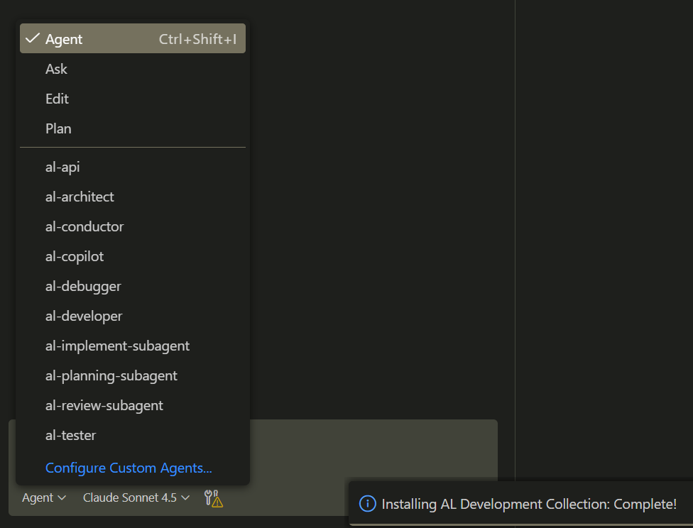

# AI Playground

Getting up to speed with modern development techniques and AI in development. 

> See Reading List further down. 

## Exercises

### Setting up 

- [ ] Get a local docker container up and running. 
- [ ] Copy your example code to one or more feature folders in the `src` folder.
- [ ] Update the `launch.json` if you want to point to a sandbox also. 
- [ ] Check the `settings.json`. 
- [ ] Run your app against the Docker container
- [ ] Install MCP Servers
- [ ] Start the MCP Servers if they are not running
- [ ] Check Visual Studio Code extensions
- [ ] Test AI installation


## Launch.json

See how to point to several servers by having multiple configurations. 


## Docker

1) Download and install **Docker Desktop**
2) Run **Windows PowerShell ISE** as Administrator. Right click on the icon and choose _Run as Administrator_
3) Open the script
4) Check the `Name` and the Business Central `Version`


If it is the first time, you might have to run

```bash
Install-Module BcContainerHelper
```

## Settings.json

### Code Analyses

```json
"al.enableCodeAnalysis": true,
"al.codeAnalyzers": [
    "${CodeCop}",
    "${UICop}",
    "${PerTenantExtensionCop}",
    "${analyzerFolder}BusinessCentral.LinterCop.dll",
],
```

### Code Cleanup

Command (`Shift+Ctrl+P`) `AZ AL Dev Tools: Run Code Cleanup on the Active Project`

```json
"alOutline.codeActionsOnSave": [
    ...
],
"alOutline.codeCleanupActions": [
    ...
],
```


### Namespace and folders

Command (`Shift+Ctrl+P`) `ATS: Set object namespace based on file path.`


```json
"ATS.RootNamespace": "<YourCompanyName>.Playground",
"ATS.UseObjectFilePathAsNamespace": true,
"ATS.EnableNamespaceDiagnostics": true,
"ATS.NamespaceMandatory": true,
```

```json
"CRS.AlSubFolderName": "src",
"CRS.OnSaveAlFileAction": "Rename",
```

### File Names

```json
"CRS.FileNamePattern": "<ObjectNameShort>.<ObjectTypeShortPascalCase>.al",
```


## MCP Servers

The MCP Servers should be install globally on you as a user.

When you look at the settings it should look something like this. 

```json
{
    "servers": {
        "microsoft-docs": {
            "type": "http",
            "url": "https://learn.microsoft.com/api/mcp",
            "gallery": true,
            "version": "0.0.1"
        },
        "github": {
            "type": "http",
            "url": "https://api.githubcopilot.com/mcp/",
            "gallery": true,
            "version": "0.0.1"
        },
        "GitKraken": {
            "command": "c:\\Users\\FinnPedersen\\AppData\\Roaming\\Code\\User\\globalStorage\\eamodio.gitlens\\gk.exe",
            "type": "stdio",
            "args": [
                "mcp",
                "--host=vscode",
                "--source=gitlens",
                "--scheme=vscode"
            ]
        },
        "bc-code-intel": {
            "type": "stdio",
            "command": "npx",
            "args": [
                "bc-code-intelligence-mcp"
            ]
        },
        "al-symbols-mcp": {
            "type": "stdio",
            "command": "npx",
            "args": [
                "al-mcp-server"
            ]
        }
    },
    "inputs": []
}
```

You should not have a local `mcp.json` in the root. If you have it is installed locally. Just delete it. 


## Visual Studio Code Extensions

Check that you these extensions.

### Business Central / AL
- andrzejzwierzchowski.al-code-outline
- davidfeldhoff.al-codeactions
- jamespearson.al-test-runner
- javierarmestogonzalez.al-development-collection
- martonsagi.al-object-designer
- ms-dynamics-smb.al
- nabsolutions.nab-al-tools
- rasmus.al-var-helper
- RaviVerma.al-interface-tracker
- statical.prism-al
- stefanmaron.businesscentral-lintercop
- tfenster.alrunner
- vdevmt.al-advanced-tools-suite
- waldo.crs-al-language-extension
- DynaBooster.al-xlf-translator
- rvanbekkum.xliff-sync

### Git & GitHub
- eamodio.gitlens
- GitHub.copilot
- GitHub.copilot-chat
- GitHub.remotehub
- github.vscode-github-actions
- GitHub.vscode-pull-request-github
- ms-vscode.remote-repositories

### Markdown & Docs
- yzhang.markdown-all-in-one
- yzane.markdown-pdf
- bierner.markdown-emoji
- bierner.markdown-mermaid

### Work Efficiency & UI
- alefragnani.Bookmarks
- Gruntfuggly.todo-tree
- johnpapa.vscode-peacock


# Working with AI Agents

## Installing Tools


### BC Code Intelligence MCP

#### MCP Server

[GitHub](https://github.com/JeremyVyska/bc-code-intelligence-mcp)

Test the installation

```
Ask: Which specialists are available for BC?
```

The answer should look something like this:

#### Core Specialists
- Alex Architect (`alex-architect`) - Solution Design & Requirements Expert
- Casey Copilot (`casey-copilot`) - AI-Enhanced Development Coach
- Chris Config (`chris-config`) - MCP Configuration & Layer Management
- Dean Debug (`dean-debug`) - Performance & Troubleshooting Specialist
- Eva Errors (`eva-errors`) - Error Handling & Exception Management
- Jordan Bridge (`jordan-bridge`) - Integration & Extensibility Architect
- Logan Legacy (`logan-legacy`) - Code Archaeology & System Analysis
- Maya Mentor (`maya-mentor`) - Teaching-Focused Development Guide
- Morgan Market (`morgan-market`) - AppSource & ISV Business Expert
- Parker Pragmatic (`parker-pragmatic`) - AI Trust & Transparency Specialist
- Quinn Tester (`quinn-tester`) - Testing Strategy & Validation Expert
- Roger Reviewer (`roger-reviewer`) - Code Quality & Standards Guardian
- Sam Coder (`sam-coder`) - Expert Development Specialist
- Seth Security (`seth-security`) - Security & Permission Management
- Taylor Docs (`taylor-docs`) - Documentation & Knowledge Management
- Uma UX (`uma-ux`) - User Experience & Interface Design

#### *Optional*: Install the files directly to your repository

[gitHub](https://github.com/JeremyVyska/bc-code-intelligence)

From the root of your BC repository use this command.

```bash
git submodule add https://github.com/JeremyVyska/bc-code-intelligence .al-guidelines
```

#### *Optional*: Workshop

[Workshop on GitHub](https://github.com/JeremyVyska/DirectionsEmea2025-Workshop)

[Workshop Setup](https://github.com/JeremyVyska/DirectionsEmea2025-Workshop/blob/main/SETUP.md)

### AL-Guidelines-Custom-Rules

My set of instructions to the AI on how to write AL code

From the root of your BC repository use this command.

```bash
git submodule add https://github.com/finnpedersenkazes/AL-Guidelines-Custom-Rules .al-guidelines-custom-rules
```

### 🚀 AL Development Collection

This tool gives you a collection of AL agents

```
1. Install from Marketplace: Search "AL Development Collection"
2. Command Palette: AL Collection: Install Toolkit to Workspace
3. Reload VS Code
```

In the Chat window select Agent and you should be able to see all the new custom agents. 



[Quick Start Guide](https://github.com/javiarmesto/AL-Development-Collection-for-GitHub-Copilot/blob/main/QUICK-START-en.md)


## Agentic Coding

[AL Guidelines - Agentic Coding](https://alguidelines.dev/docs/agentic-coding/)


## Coding Guidelines

- Have a folder per feature
- Use Namespaces
- Follow naming guidelines
  - Object Names
  - Field Names
  - Function Names
  - Variable Names
- Organize code in pure functions
- Avoid at all cost global variables. 
- Use `this.` to indicate global functions and variables. 
- 


## Housekeeping

### Update AL-Go System Files

In GitHub, go to Actions and choose `Update AL-Go System Files`.

## Reading List

### Steven Renders (Think About IT)

[A Practical Mental Model for Using GitHub Copilot in AL Development](https://thinkaboutit.be/2025/12/a-practical-mental-model-for-using-github-copilot-in-al-development/)

The Series at a Glance
This series consists of four posts:

[Introduction to GitHub Copilot in VSCode for AL Development](https://thinkaboutit.be/2025/12/introduction-to-github-copilot-in-vscode-for-al-development/)

[Chat, Ask, or Edit? Using GitHub Copilot Effectively in AL Development](https://thinkaboutit.be/2025/12/chat-ask-or-edit-using-github-copilot-effectively-in-al-development/)

[Copilot Agent in AL: Using It Well Without Losing Control](https://thinkaboutit.be/2025/12/copilot-agent-in-al-using-it-well-without-losing-control/)

[Copilot Plan Mode in AL: Clarifying Intent Before Writing Code](https://thinkaboutit.be/2025/12/copilot-plan-mode-in-al-clarifying-intent-before-writing-code/)
